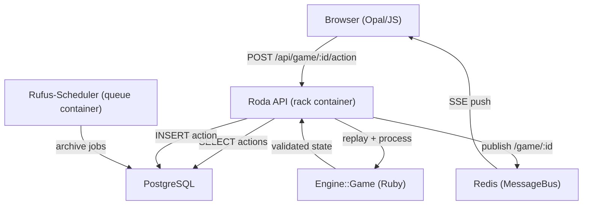

# Architecture Overview

18xx.games is a six-layer system: browser client, Roda API, game engine, PostgreSQL database, Redis message broker, and a background scheduler. This page explains each layer and why it is designed the way it is.

## Layer 1 — Browser

The browser runs the full engine as JavaScript transpiled by [Opal](https://opalrb.com/) [`Gemfile:9`]. The UI framework is Snabberb, a minimal virtual-DOM library [`Gemfile:18`]. Before sending any action to the server, the local engine validates the move. This provides immediate feedback and prevents wasted round-trips. After the server confirms the action, the browser receives the updated state via Server-Sent Events.

## Layer 2 — Roda API (`api.rb:16`)

`class Api < Roda` is the entry point for all HTTP requests. Roda plugins used:

- `:streaming` — Server-Sent Events
- `:json` / `:json_parser` — JSON request and response bodies
- `:assets` — serves compiled Opal JS bundles; each game title has its own bundle
- `:hash_routes` — routes delegated to `routes/game.rb` and `routes/user.rb`

The API acquires a **PostgreSQL Advisory Lock** (via `sequel-pg_advisory_lock`) on the game ID before loading actions [`routes/game.rb:56`]. This serialises concurrent requests for the same game and prevents state corruption.

## Layer 3 — Engine

`Engine::Game::Base` (and title subclasses) is a pure Ruby state machine. It has no I/O dependency — it receives an array of Actions, replays them from scratch, and returns the new state. This design allows:

- The same class to run in the browser (Opal) and on the server (MRI Ruby)
- Deterministic reconstruction of any historical state by replaying a prefix of the action list
- Simple testing: supply a fixture action list, assert final state

## Layer 4 — PostgreSQL

Three primary tables:

| Table | Columns of interest |
|-------|---------------------|
| `users` | `id`, `name`, `email`, `password` (Argon2 hash), `settings` (JSONB) |
| `games` | `id`, `title`, `description`, `status`, `settings` (JSONB), `user_id`, `created_at` |
| `actions` | `id`, `game_id`, `action_id` (sequential per game), `action` (JSONB) |

The game state is never persisted directly. Only the action list is stored. Full state is reconstructed by replaying the list every time a request is received [`lib/engine/game/base.rb:819-837`].

## Layer 5 — Redis MessageBus (`lib/bus.rb:1`)

After each accepted action the API publishes the updated game state to Redis channel `/game/:id`. All browser clients subscribed to that game receive the push as a Server-Sent Event and update the UI. Cache entries for user timestamps (`user_ts`) have a 5-minute TTL; user stats have a 25-hour TTL.

## Layer 6 — Rufus-Scheduler (`queue.rb`)

The `queue` container runs background jobs:

- **Daily archival**: games finished more than one year ago, or inactive for more than 90 days, are archived. Archived games lose their action list [`queue.rb:35-48`].
- **User stats**: recalculates aggregate statistics for active users.

## Why Action Replay Instead of Snapshots?

Storing only Actions and replaying on load keeps the persistence schema simple and version-independent. A snapshot would need to be migrated every time a game object changes. With replay, old games just need the Action list to be valid; the engine is re-run in its current form.

The trade-off is replay latency: a game with thousands of actions takes longer to load than one with a snapshot. In practice, 18xx games are bounded in length, so replay time stays within acceptable limits.

## What's next

- Objects involved in a move: [Mental Model](mental-model.html)
- A move step by step: [Core Flow](kernablauf.html)
- Round and Step design: [Round/Step System](round-step-system.html)
- Design decisions: [ADRs](adrs.html)

---
*Version: 2026-05-08 — derived from `api.rb`, `lib/bus.rb`, `queue.rb`, `db.rb`, `Gemfile`, `lib/engine/game/base.rb`, `routes/game.rb`.*
