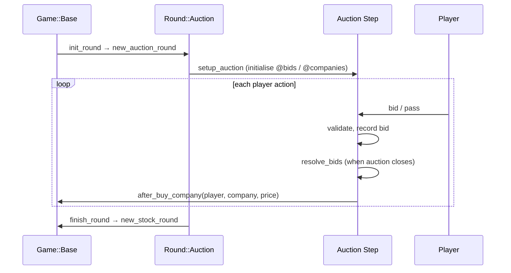

# Auction Rounds

Most 18xx titles begin with an auction or draft that distributes private companies to players before the first Stock Round. This page covers how to configure the two standard auction types, the constants that control bidding, and when to write a custom auction step.

---

## How Auction Rounds Fit In

The engine calls `init_round()` on game start [`lib/engine/game/base.rb`]. The default implementation returns `new_auction_round()`, which produces a `Round::Auction` containing `Step::WaterfallAuction`. Override `new_auction_round` in your `game.rb` to choose a different auction style or step list.



---

## Choosing an Auction Style

| Style | Step class | How it works | Typical titles |
|-------|-----------|--------------|----------------|
| **Waterfall** | `Step::WaterfallAuction` | All companies visible at once. Players bid on the cheapest available company. A single bid buys it outright; two or more bids open a live auction. Unsold companies get cheaper each round until forced onto the last player. | 1830, 1846, 18Chesapeake |
| **Selection** | `Step::SelectionAuction` | One company at a time. The active player either buys the cheapest company outright or nominates it for auction. All players then bid in sequence; highest bid wins. | 1817, 1840 |
| **Custom** | Your own Step subclass | Any other mechanic (Dutch auction, draft, concession). | 1848, 1812 |

---

## Waterfall Auction

### Wiring it up

```ruby
# In game.rb
def new_auction_round
  Round::Auction.new(self, [
    Engine::Step::CompanyPendingPar,
    Engine::Step::WaterfallAuction,
  ])
end
```

`Step::CompanyPendingPar` handles the edge case where a company is bought but its associated corporation has not yet set a par price — include it whenever companies have `par` abilities.

### How bidding resolves

1. Companies are sorted cheapest-first.
2. A player may bid on **only the cheapest unbought company** while no live auction is running.
3. A single uncontested bid purchases the company at the bid price.
4. When two or more bids exist on the cheapest company, a live auction opens — other players may raise until all but one pass.
5. If all players pass on the cheapest company, its minimum price decreases by `WATERFALL_AUCTION_PRICE_DISCOUNT` (default: face value ÷ 2). When the company price hits zero, the current player is forced to take it for free.

### Key constants

| Constant | Default | Effect |
|----------|---------|--------|
| `MIN_BID_INCREMENT` | `5` | Minimum raise amount |
| `MUST_BID_INCREMENT_MULTIPLE` | `false` | If `true`, all bids must be multiples of `MIN_BID_INCREMENT` |
| `ONLY_HIGHEST_BID_COMMITTED` | `false` | If `true`, only the highest bid per company locks up player cash; other bids are free to exceed cash |

```ruby
# In game.rb
MIN_BID_INCREMENT = 5
MUST_BID_INCREMENT_MULTIPLE = true
```

---

## Selection Auction

### Wiring it up

```ruby
def new_auction_round
  Round::Auction.new(self, [
    Engine::Step::SelectionAuction,
  ])
end
```

### How bidding resolves

1. The active player may buy the cheapest company at face value, or nominate it for auction.
2. If nominated, all other players bid in turn order. Each player may raise or pass. The last player standing wins at their bid price.
3. The player who triggered the auction bids last and may raise above their own trigger bid.
4. If no one bids against the nominator, they buy at face value.

---

## Controlling Which Companies Auction

`initial_auction_companies` returns the list of companies that appear in the auction. The default returns all of `@companies`. Override to exclude certain companies or change the starting order:

```ruby
# Only auction the first four companies; the rest are assigned later
def initial_auction_companies
  @companies.first(4)
end
```

```ruby
# Exclude companies with the :minor type from the initial auction
def initial_auction_companies
  @companies.reject { |c| c.type == :minor }
end
```

---

## Post-Purchase Hook

After any company purchase `Step::WaterfallAuction` calls `game.after_buy_company(player, company, price)`. The base class does nothing; override to fire game-specific effects:

```ruby
def after_buy_company(player, company, price)
  # Example: the cheapest company grants a free share of corporation A
  return unless company.sym == 'RVR' && price == company.min_price
  share = @corporations.find { |c| c.sym == 'A' }.shares.first
  @share_pool.buy_shares(player, share, exchange: :free)
end
```

---

## Auction Constants in game.rb

These constants are read by all auction steps:

```ruby
# In game.rb
MIN_BID_INCREMENT             = 5      # minimum raise
MUST_BID_INCREMENT_MULTIPLE   = false  # enforce multiples
ONLY_HIGHEST_BID_COMMITTED    = false  # cash reservation scope
```

`ONLY_HIGHEST_BID_COMMITTED = true` is useful when a player may bid on multiple companies simultaneously (common in waterfall). With this set, the player's cash is only locked for their highest bid on each company rather than the sum of all bids.

---

## Writing a Custom Auction Step

Use this when neither waterfall nor selection matches your rules.

### Step 1 — Choose a base

| Base | When to use |
|------|------------|
| Include `Engine::Step::Auctioner` | Multiple simultaneous auctions on different companies |
| Include `Engine::Step::PassableAuction` | Single live auction, players eliminated on pass |
| Inherit `Engine::Step::WaterfallAuction` | Minor variation of waterfall |
| Inherit `Engine::Step::SelectionAuction` | Minor variation of selection |

### Step 2 — Required overrides

```ruby
# frozen_string_literal: true

require_relative '../../../step/base'
require_relative '../../../step/auctioner'

module Engine
  module Game
    module G8888
      module Step
        class DraftAuction < Engine::Step::Base
          include Engine::Step::Auctioner

          ACTIONS = %w[bid pass].freeze

          def actions(entity)
            return [] unless entity == current_entity
            ACTIONS
          end

          def setup
            setup_auction   # initialises @bids from Auctioner
            @companies = @game.initial_auction_companies.sort_by(&:value)
          end

          # Minimum bid for a company
          def min_bid(company)
            return company.min_price if @bids[company].empty?
            high = @bids[company].max_by(&:price)
            high.price + min_increment
          end

          # Maximum a player may bid (limited by their cash)
          def max_bid(entity, _company)
            entity.cash
          end

          def process_bid(action)
            add_bid(action)     # from Auctioner: validates, records
            resolve_bids        # check if auction can close
          end

          def process_pass(action)
            pass_auction(action.entity)   # from Auctioner
          end

          def resolve_bids
            @companies.each do |company|
              bids = @bids[company]
              next if bids.empty?
              next if bids.size > 1   # still contested

              buy_company(bids.first.entity, company, bids.first.price)
            end
          end

          private

          def buy_company(player, company, price)
            @game.log << "#{player.name} buys #{company.name} for #{@game.format_currency(price)}"
            player.spend(price, @game.bank)
            player.companies << company
            company.owner = player
            @companies.delete(company)
            @bids.delete(company)
            @game.after_buy_company(player, company, price)
          end
        end
      end
    end
  end
end
```

### Step 3 — Register in new_auction_round

```ruby
require_relative 'step/draft_auction'

def new_auction_round
  Round::Auction.new(self, [
    Engine::Step::CompanyPendingPar,
    G8888::Step::DraftAuction,
  ])
end
```

---

## Reference Titles

| Mechanic | Title | Step file |
|----------|-------|-----------|
| Standard waterfall | 1830 | `lib/engine/step/waterfall_auction.rb` |
| Selection / priority bid | 1817 | `lib/engine/step/selection_auction.rb` |
| Waterfall with extra bid commit rules | 1846 | `lib/engine/game/g_1846/step/` |
| Dutch auction variant | 1848 | `lib/engine/game/g_1848/step/dutch_auction.rb` |
| Concession / hybrid | several | `lib/engine/step/concession_auction.rb` |

Search for titles using a specific auction type:

```bash
grep -rl "WaterfallAuction"   lib/engine/game/
grep -rl "SelectionAuction"   lib/engine/game/
grep -rl "DutchAuction"       lib/engine/game/
```

---

## Debugging an Auction

Load a fixture up to the end of the auction round in IRB:

```ruby
require_relative 'lib/engine'
raw = JSON.parse(File.read('public/fixtures/1830/26855.json'))
g = Engine::Game::G1830::Game.new(
  raw['players'].map { |p| p['name'] },
  id: raw['id'],
  actions: raw['actions'].first(20)   # adjust to end of ISR
)

g.current_round.class               # => Engine::Round::Auction
g.current_round.active_step.class   # => Engine::Step::WaterfallAuction

step = g.current_round.active_step
step.instance_variable_get(:@companies)   # remaining companies
step.instance_variable_get(:@bids)        # current bids
```

---

## What's Next

- Tile lays and map setup in the OR: [Map Configuration](map.html)
- Custom dividend logic: [Rounds & Steps](round-step-system.html)
- Testing the auction with a fixture: [Testing Your Game](testing.html)
- Complete title tutorial from the beginning: [Game Structure](game-implementation.html)

---
*Version: 2026-05-08 — derived from `lib/engine/round/auction.rb`, `lib/engine/step/waterfall_auction.rb`, `lib/engine/step/selection_auction.rb`, `lib/engine/step/auctioner.rb`, `lib/engine/step/passable_auction.rb`, `lib/engine/game/base.rb`.*
