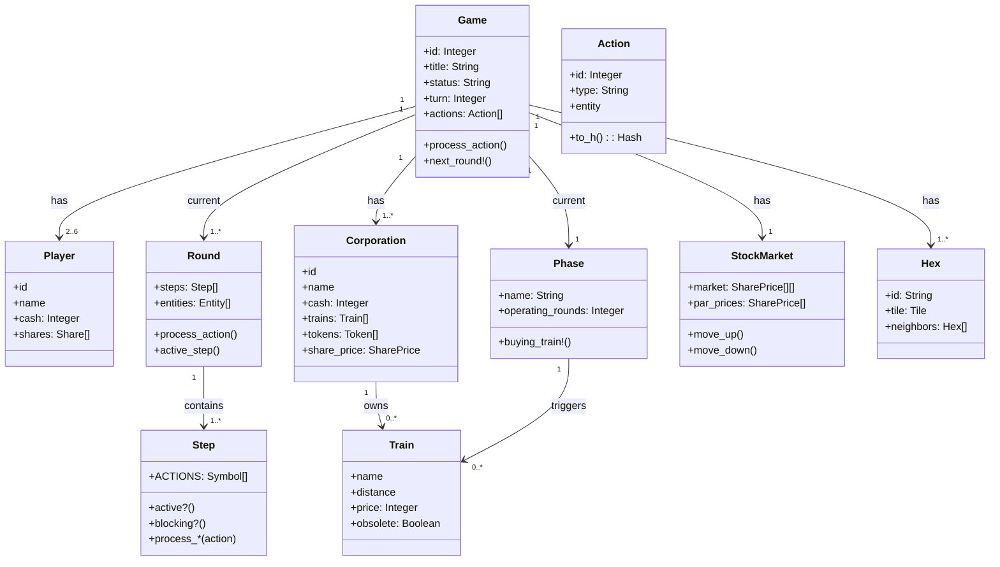
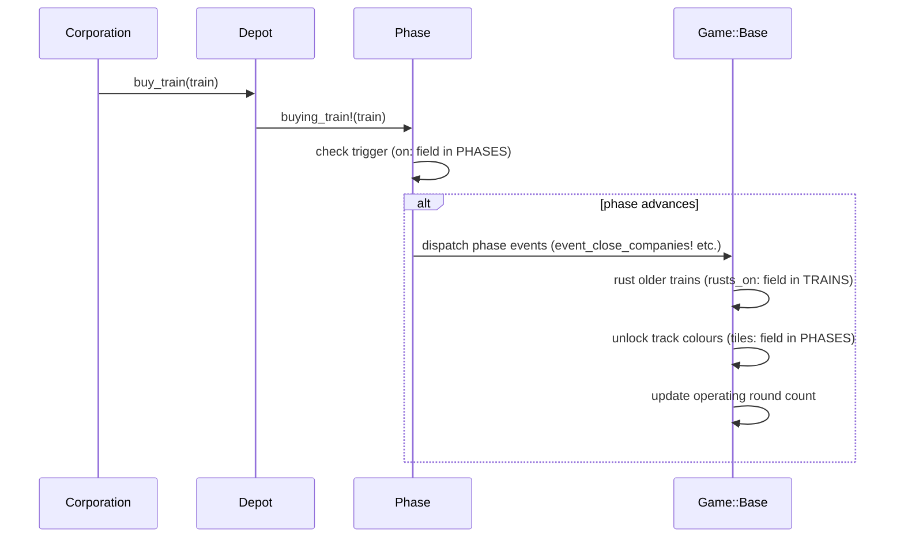

# Understanding the Engine

Before writing your first line of game code, it helps to understand why the engine is built the way it is and how the key objects fit together. This page is the mental model you need before working through the rest of the tutorial.

---

## The Core Invariant: Only Actions Are Persisted

The 18xx.games engine never saves the game state — the board layout, cash totals, stock prices — to the database. It saves only the **sequence of Actions** that produced that state. Every time a page loads, the engine replays all actions from scratch to reconstruct the state.

This means:

- There is no migration risk from state format changes.
- A fixture test is just "replay these actions and check the final scores."
- Adding a new game title requires only defining the starting conditions and how each action type changes them.

The trade-off is that load time grows with game length. Caching and the PIN mechanism (locking old games to a JS bundle snapshot) address this.

---

## The Object Map

---

## The Four Runtime Layers

When you implement a game title, you are working in exactly one of these layers per change:

| Layer | Where | What you control |
|-------|-------|-----------------|
| **L1 — Constants** | `game.rb`, `entities.rb`, `map.rb` | TRAINS, PHASES, CORPORATIONS, HEXES, MARKET |
| **L2 — Event hooks** | `game.rb` overrides | Named methods called when engine events fire (`event_close_companies!`, `operating_order`, etc.) |
| **L3 — Step overrides** | `step/` directory | Decision logic within an existing Step type |
| **L4 — New Step / Round** | `step/` or `round/` directory | Entirely new action types or turn structures |

Work at the lowest layer that solves the problem. Constants first, then event hooks, then step overrides, then new Steps. Adding a new Step is significant; most title-specific rules only need a constant or a method override.

**g_1830 is the gold standard for L1**: 95% of its mechanics live in constants.

### L1 — What each constant captures

**`TRAINS` entries:**
- Train roster: `name:`, `distance:`, `price:`, `num:`
- Rust triggers: `rusts_on:`, `obsolete_on:`
- Availability gate: `available_on:` (train only appears after another is bought)
- Purchase discounts: `discount: {'2' => 30}` hash
- Variants: `variants:` array (sub-types selectable at buy time; each can have own `rusts_on:`)
- Revenue multipliers on variants: `multiplier:` int
- Phase-transition events: `events: [{'type' => 'xxx'}]` — dispatched to `event_xxx!`
- Multi-node distance specs: `distance:` as array of `{'nodes'=>[...], 'pay'=>N, 'visit'=>N}`

**`PHASES` entries:**
- Train limit per phase (scalar or `{minor: N, major: N, national: N}` hash)
- Available tile colours: `tiles:`
- Operating rounds per phase: `operating_rounds:`
- Status flags: string array mapping to `STATUS_TEXT`
- Phase-trigger events: same `events:` key as trains

**`CORPORATIONS` / `MINORS` entries:**
- Type field: `:minor` / `:major` / `:national`
- Token stack and costs: `tokens:`
- Home coordinates + city index: `coordinates:`, `city:`
- Float percent: `float_percent:`

**Scalar game constants (selection):**
- `CAPITALIZATION` — `:full`, `:incremental`, `:none`
- `SELL_BUY_ORDER`, `SELL_AFTER`, `SELL_MOVEMENT`, `POOL_SHARE_DROP`
- `MUST_BUY_TRAIN`, `MUST_SELL_IN_BLOCKS`, `EBUY_FROM_OTHERS`, `EBUY_PRES_SWAP`
- `HOME_TOKEN_TIMING`, `TILE_RESERVATION_BLOCKS_OTHERS`, `TRACK_RESTRICTION`
- `BANK_CASH`, `STARTING_CASH`, `CERT_LIMIT`, `CURRENCY_FORMAT_STR`
- `GAME_END_CHECK` hash of reason → timing
- `TILE_LAYS` array of lay-slot hashes for default entity type
- `STATUS_TEXT`, `EVENTS_TEXT`, `MARKET_TEXT`, `GAME_END_REASONS_TEXT`

### L2 — Key hook methods

| Hook method | What it controls |
|-------------|-----------------|
| `tile_lays(entity)` | Lay budget per entity type and/or phase |
| `revenue_for(route, stops)` | Route revenue bonus additions |
| `float_corporation(corp)` | When/how corp receives IPO cash |
| `must_buy_train?(entity)` | Whether corp is forced to buy a train |
| `upgrades_to?(from, to, ...)` | Custom tile upgrade validation |
| `check_distance(route, visits)` | Route validity rules |
| `check_other(route)` | Extra single-route validity rules |
| `operating_order` | Order entities operate in the OR |
| `next_round!` | Inter-round sequencing |
| `event_xxx!` | Any named phase/train event handler |
| `num_trains(train)` | Override train count (e.g. gated availability) |
| `buying_power(entity)` | Available spending budget |
| `can_par?(corp, parrer)` | Whether a corp can be parred |
| `setup` | One-time game initialisation |
| `action_processed(action)` | Post-action side effects |
| `sold_out_increase?` | Stock market UP movement eligibility |

### L3 — Common custom Step and Round categories

| Category | What it changes |
|----------|----------------|
| Waterfall auction | How privates/minors are allocated at game start |
| Minor acquisition | OR step for a major to absorb a minor |
| Merger/conversion | Corp merges or converts; share reduction |
| Emergency issue/buy | Emergency train purchase flow |
| Nationalization | National corp auto-formation and auto-operation |
| Custom Operating round | Extended start_operating / skip logic |

---

## Game, Round, and Step

A **Game** (`Game::Base`) is the top-level container. It holds all objects and knows which Round is active. Each of the 100+ game titles is a subclass with its own constant definitions.

A **Round** is a turn segment — Stock Round, Operating Round, Auction Round. It holds an ordered list of **Steps** and an ordered queue of entities (players or corporations) that act in sequence.

A **Step** is an atomic decision unit. It declares `ACTIONS` — the action types it handles — and implements `process_<type>(action)` for each. The Round asks Steps in order: "can you handle this?" The first blocking Step that claims the action type handles it.

The UI reads the union of all active Steps' `ACTIONS` lists to decide which buttons to enable. If a button is greyed out, no active Step is claiming that action type for the current entity.

---

## How an Action Travels

```mermaid
stateDiagram-v2
    [*] --> Created : User clicks a UI control
    Created --> LocalValidated : Client-side engine validates against local state
    LocalValidated --> Sent : HTTP POST to /api/game/:id/action
    Sent --> Replayed : Advisory Lock acquired; all prior Actions replayed
    Replayed --> ServerValidated : New Action applied to fresh engine state
    ServerValidated --> Persisted : Action inserted into actions table
    Persisted --> Broadcast : Published to Redis /game/:id channel
    Broadcast --> [*] : SSE delivers updated state to all connected clients
    ServerValidated --> Rejected : Validation error — 422 response
    Rejected --> [*] : Client shows error; no state change persisted
```

The same engine code runs on both sides. The browser validates optimistically; the server validates authoritatively. Your game code only needs to be correct once.

---

## How Phases Advance

Buying the first copy of a train advances the game phase. This is the engine's primary mechanism for progressing the development arc:

The `on:` field in each `PHASES` entry names the train whose first purchase triggers that phase. A single purchase can advance the phase and fire multiple events simultaneously.

---

## Event Handler Library

Event handlers are dispatched from `TRAINS` or `PHASES` `events:` arrays via `@game.send("event_#{type}!")`. They must exist in `game.rb` or `base.rb`.

| Event name | What it does | Source |
|------------|-------------|--------|
| `close_companies` | Closes all companies with no owner or qualifying criteria | `base.rb` |
| `remove_reservations` | Removes all unsold home reservations | `1846` |
| `remove_bonuses` | Removes east-west / bonus tokens | `1846` |
| `float_30` / `float_40` / `float_60` | Changes float threshold mid-game | `1880` |
| `green_minors_available` | Minors can buy green trains | `1867/1861` |
| `majors_can_ipo` | Major corps open for IPO | `1867/1861` |
| `minors_cannot_start` | Minors blocked from starting | `1867/1861` |
| `minors_nationalized` | All remaining minors nationalize | `1867/1861` |
| `trainless_nationalization` | Trainless entities nationalize | `1867/1861` |
| `nationalize_companies` | Privates absorbed into national | `1867/1861` |
| `phase_revenue` | Changes private revenues by phase | `1822 family` |
| `full_capitalisation` | Full cap event | `1822, 1880` |
| `trigger_endgame` | Signals game-end countdown | `1868_wy` |

Define your own by adding `events: [{'type' => 'my_event'}]` to a `TRAINS` or `PHASES` entry and implementing `event_my_event!` in `game.rb`.

---

## Key Terms

| Term | What it means |
|------|--------------|
| **Action** | A persisted move: entity, type (`buy_shares`, `lay_tile`, etc.), and type-specific args |
| **Advisory Lock** | PostgreSQL lock per game ID — prevents parallel requests from corrupting the same session |
| **Bank** | Central cash reserve; can trigger end-of-game when exhausted |
| **Certificate Limit** | Maximum certificates a player may hold (game-specific, player-count-dependent) |
| **Company** | Private company auctioned at game start; grants special abilities |
| **Corporation** | Investable railway company with shares, trains, tokens, and a stock market position |
| **DEV_STAGE** | Title status: `:prealpha` → `:alpha` → `:beta` → `:production` |
| **Depot** | Supply of unsold trains |
| **Ebuy** | Emergency Buy — a corporation with no train must buy one, using the president's cash if needed |
| **Entity** | Collective term for anything that can act: Player, Corporation, Minor, Company |
| **Graph** | Routing graph computed from current track layout; used for revenue calculation |
| **Hotseat** | Local multiplayer mode (no server) |
| **Minor** | Small subsidiary in certain titles; can own shares and run routes |
| **Opal** | Ruby-to-JavaScript transpiler that lets the engine run in the browser |
| **Par** | Issue price at IPO; sets the starting stock market position |
| **Phase** | Game segment advanced by train purchases; controls track colours, OR count, and train rusting |
| **Pin** | Locks a running game to an older JS bundle to prevent breaking replays |
| **Round** | Turn segment (SR, OR, Auction); contains Steps and Entities |
| **Step** | Atomic decision unit; declares `ACTIONS` and handles them |
| **Stock Round (SR)** | Players buy and sell shares |
| **Operating Round (OR)** | Corporations lay track, place tokens, buy trains, run routes |
| **StockMarket** | 2D price grid; buys/sells move a corporation's marker |
| **Tile** | Track tile on a Hex; contains paths, cities, towns |
| **Token** | Corporation's presence marker on a city |
| **Train** | Corporation's train; has reach (distance) and triggers phase transitions |

---

## Where to Look Things Up

| Question | Where to look |
|----------|--------------|
| What does Game::Base provide by default? | `lib/engine/game/base.rb` — skim the constants block at the top |
| Where is a Step registered? | The `operating_round` or `stock_round` method in the title's `game.rb` |
| How does an existing action type work? | `lib/engine/step/<action>.rb` |
| What events does a phase/train trigger? | `lib/engine/phase.rb` and the title's `PHASES`/`TRAINS` constants |
| What does a production title look like? | `lib/engine/game/g_1830/` (canonical reference), `lib/engine/game/g_1846/` (incremental cap), `lib/engine/game/g_1867/` (minor conversion) |

---

## What's Next

Work through the tutorial in order:

1. [Development Setup](getting-started.html) — get Docker running and the test suite green
2. [Game Structure](game-implementation.html) — create the four files every title needs
3. [Map Configuration](map.html) — define hexes, location names, and tile supply
4. [Corporations & Companies](entities.html) — define the entities players interact with
5. [Trains, Phases & Market](trains-phases.html) — configure the economic arc
6. [Rounds & Steps](round-step-system.html) — customise the decision sequence

---
*Version: 2026-05-08 — derived from `lib/engine/game/base.rb`, `lib/engine/round/base.rb`, `lib/engine/step/base.rb`, `lib/engine/phase.rb`.*
