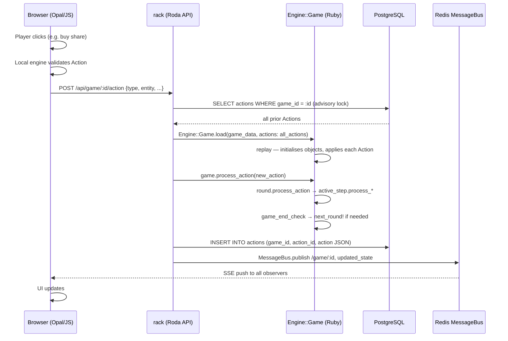

# Core Flow — A Move from Click to State Change

18xx.games runs the same engine logic twice: once in the browser (Opal/JS for immediate UI feedback) and once on the server (Ruby for the authoritative state change). The browser only sends the move to the server after local validation has passed.

## Phase 1 — Local Validation in the Browser

The browser runs the entire engine as JavaScript (transpiled via Opal [`lib/engine.rb:8-11`]). When a player clicks an action, the local engine checks whether the Action is permitted for the current Step before the request is sent to the server. This prevents unnecessary round-trips and gives immediate feedback.

## Phase 2 — HTTP Request and Advisory Lock

The browser sends `POST /api/game/:id/action` with the Action as a JSON payload [`routes/game.rb:54-58`]. The API immediately acquires a PostgreSQL Advisory Lock on the game ID [`routes/game.rb:56`] so that parallel requests cannot corrupt the same session.

## Phase 3 — Engine Replay

Because the game state is not persisted directly, the API loads all prior Actions from the database and passes them to the engine [`lib/engine/game/base.rb:819-837`]. The engine `initialize` method rebuilds every game object (Corporations, Players, StockMarket, Hexes) from scratch and applies each Action in sequence [`lib/engine/game/base.rb:566-694`]. The result is the state immediately before the new move.

## Phase 4 — Processing the New Action

`Game::Base#process_action` delegates to `round.process_action` [`lib/engine/game/base.rb:838-898`]. The Round finds the first active, blocking Step that recognises the action type and calls its `process_<type>` method [`lib/engine/round/base.rb:75-107`]. After processing, the engine checks whether the game has ended (`game_end_check`) [`lib/engine/game/base.rb:2970`] and decides whether a round transition (`next_round!`) is required [`lib/engine/game/base.rb:2921-2943`].

## Phase 5 — Persistence and Broadcast

The new Action is inserted as a JSON row into `actions` [`models/game.rb:1-10`]. The API then publishes the updated state over Redis MessageBus [`lib/bus.rb:1-30`] to all browsers observing the game. Each browser client receives the Server-Sent Event and updates the UI.

## What's next

- Objects involved in this flow: [Mental Model](mental-model.html)
- Round and Step in depth: [Round/Step System](round-step-system.html)
- Why replay instead of snapshot: [ADR-002](adrs.html)
- Technical topology: [Architecture Overview](architecture.html)

---
*Version: 2026-05-08 — derived from `lib/engine/game/base.rb`, `lib/engine/round/base.rb`, `routes/game.rb`.*
