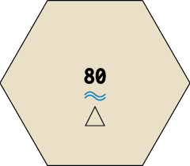
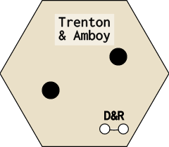
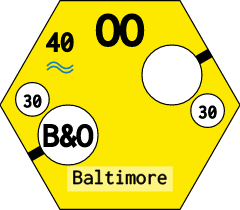
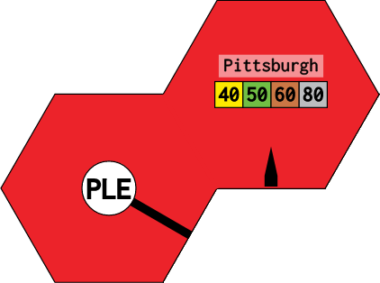
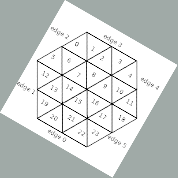
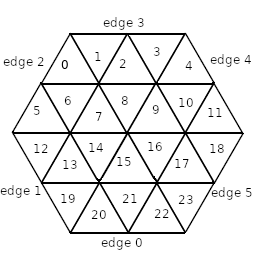

# Map Configuration Reference

This page documents the three constants that define a game's physical map: `TILES`, `LOCATION_NAMES`, and `HEXES`. All three live in the title's `map.rb` file as a module included by the main `Game` class. For the tile string syntax used in actual tile definitions (`lib/engine/tile.rb`), see [Tile Reference](tiles.html).

---

## TILES

`TILES` is a hash from tile number (String) to the number of copies available in the tile bank.

```ruby
TILES = {
  '3'  => 2,
  '4'  => 2,
  '7'  => 4,
  '8'  => 8,
  '9'  => 7,
  '14' => 3,
  '15' => 3,
  '57' => 4,
  '58' => 2,
  '80' => 2,
  '81' => 2,
  '82' => 2,
  '83' => 2,
}.freeze
```

Tile numbers refer to the standard 18xx tile catalog. Run `/tiles/all` on your local instance to browse every available tile, or `/tiles/<number>` to inspect a single tile at large scale.

If a tile number is omitted from `TILES`, it is unavailable in the game. If the quantity is exhausted during play, the engine prevents further lays of that tile.

---

## LOCATION_NAMES

`LOCATION_NAMES` maps hex coordinates to the display names shown on the map.

```ruby
LOCATION_NAMES = {
  'D2'  => 'Lansing',
  'F2'  => 'Chicago',
  'H12' => 'Altoona',
  'G19' => 'New York & Newark',
  'E23' => 'Boston',
}.freeze
```

A hex does not need an entry here. Hexes without a location name display no label. Coordinates follow the column-row format where the column is a letter and the row is an integer (e.g. `'G19'`). The exact labelling convention (odd vs even columns for pointy-top layouts) depends on the `LAYOUT` value.

---

## HEXES

`HEXES` is a hash of hashes. The outer key is a Symbol representing the starting colour of the hex group; the inner hash maps one or more coordinates to a tile definition string.

```ruby
HEXES = {
  red: {
    ['F2'] => 'offboard=revenue:yellow_40|brown_70;path=a:3,b:_0;path=a:4,b:_0;path=a:5,b:_0',
  },
  gray: {
    ['D2'] => 'city=revenue:20;path=a:5,b:_0;path=a:4,b:_0',
  },
  white: {
    %w[F4 J14 F22] => 'city=revenue:0;upgrade=cost:80,terrain:water',
    %w[B20 D4 F10] => 'town=revenue:0',
    %w[I13 D18 B12] => '',
    %w[G15 C21]    => 'upgrade=cost:120,terrain:mountain',
  },
  yellow: {
    ['G19'] => 'city=revenue:40;city=revenue:40;path=a:3,b:_0;path=a:0,b:_1;label=NY;upgrade=cost:80,terrain:water',
  },
}.freeze
```

### Hex colours

| Colour | Meaning | Upgradeable? |
|--------|---------|-------------|
| `white` | Empty hex or blank track | Yes |
| `yellow` | Pre-printed yellow tile | Yes (to green) |
| `green` | Pre-printed green tile | Yes (to brown) |
| `gray` | Permanently fixed track or city | No |
| `red` | Off-map revenue space | No |

### Hex colour examples

**White — terrain only (mountain + water upgrade cost, no track):**

```
upgrade=cost:80,terrain:water|mountain
```



---

**White — two unconnected towns (no paths; players lay tiles to connect them):**

```
town=revenue:0;town=revenue:0
```



---

**Yellow (preprinted) — two-city OO hex with water upgrade cost:**

```
city=revenue:30;city=revenue:30;path=a:1,b:_0;path=a:4,b:_1;label=OO;upgrade=cost:40,terrain:water
```



---

**Red (offboard) — split offboard across two hexes with border and phase-keyed revenue:**

- A3: `city=revenue:yellow_40|green_50|brown_60|gray_80,hide:1,groups:Pittsburgh;path=a:5,b:_0;border=edge:4`
- B2: `offboard=revenue:yellow_40|green_50|brown_60|gray_80,groups:Pittsburgh;path=a:0,b:_0;border=edge:1`



---

### Grouping hexes

Multiple coordinates that share the same tile string may be grouped into an array as the key:

```ruby
%w[B2 C1 E3 F4] => 'upgrade=cost:80,terrain:mountain'
```

This is purely syntactic sugar — each coordinate gets an independent copy of the tile.

### Tile definition string in HEXES

The string assigned to each coordinate is a semicolon-separated sequence of *parts*. Each part is a `type=key:value,key:value` expression. The same tile string language is used in the shared tile catalog, with the addition that `HEXES` strings may include `upgrade=` to set terrain cost and the `revenue:` values may be phase-specific.

#### Parts reference

**`city=`**

A city node (counts toward train distance; generates revenue).

| Key | Description |
|-----|-------------|
| `revenue:` | Revenue integer, or phase-keyed string (see below) |
| `slots:` | Number of token slots (default `1`) |

**`town=`**

A town node (counts toward train distance; generates lower revenue).

| Key | Description |
|-----|-------------|
| `revenue:` | Revenue integer or phase-keyed string |
| `boom:` | If `true`, town generates double revenue in brown/gray phase |

**`offboard=`**

An off-map revenue space.

| Key | Description |
|-----|-------------|
| `revenue:` | Phase-keyed revenue string (always use phase-keyed values for offboards) |
| `groups:` | Comma-separated group names; routes cannot use two offboards in the same group |

**`path=`**

A track segment connecting edges or nodes.

| Key | Description |
|-----|-------------|
| `a:` | Starting endpoint: edge number `0`–`5`, or node reference `_0`, `_1`, … |
| `b:` | Ending endpoint: same format as `a:` |

**`upgrade=`**

Terrain cost applied when a tile is laid or upgraded on this hex.

| Key | Description |
|-----|-------------|
| `cost:` | Extra cost in addition to the standard upgrade price |
| `terrain:` | `mountain`, `water`, or `desert`; the UI shows a terrain icon |

**`border=`**

An impassable or special boundary along an edge.

| Key | Description |
|-----|-------------|
| `edge:` | Edge number `0`–`5` |
| `type:` | `impassable` blocks routing through that edge |
| `color:` | CSS colour for the border line |

**`label=`**

A city label (e.g. `NY`, `B`, `OO`) that restricts which tile numbers may be placed here and affects revenue bonuses in some titles.

| Key | Description |
|-----|-------------|
| (value only) | Label string: `label=NY`, `label=OO`, `label=B` |

**`icon=`**

A decorative icon rendered inside the hex.

| Key | Description |
|-----|-------------|
| `image:` | Path under `public/icons/` |
| `name:` | Display name shown on hover |

#### Phase-keyed revenue

Revenue values that change by phase use the format `<colour>_<value>|<colour>_<value>`:

```
revenue:yellow_30|green_40|brown_60|gray_80
```

This is most commonly used for offboard hexes and some gray cities.

### Edge numbering

Edges are numbered 0–5 starting from the top-right and going clockwise. The exact orientation depends on `LAYOUT`:

**Pointy-top hexagon (`:pointy`)** — most North American titles



**Flat-top hexagon (`:flat`)** — used in some European titles



Node references (`_0`, `_1`, …) in the diagrams above correspond to city or town nodes in the order they appear in the tile string, counting from zero.

---

## LAYOUT

`LAYOUT` specifies the hexagon orientation:

```ruby
LAYOUT = :pointy   # Pointy-top (most common)
# or
LAYOUT = :flat     # Flat-top
```

The value affects edge numbering, adjacency calculations, and the coordinate system used in `HEXES` and `LOCATION_NAMES`.

---

## Hex Coordinate System

Coordinates combine a column letter and a row number. In `:pointy` layout, columns advance left-to-right and rows top-to-bottom, with odd and even columns offset by half a hex vertically:

```
A1  B2  C1  D2  E1
    A3  B4  C3  D4
A5  B6  C5  D6  E5
```

The starting point and step increment depend on the map's dimensions. Inspect existing `map.rb` files (`/tiles/<game_title>/all` renders them) to calibrate your coordinate grid.

---

## Preprinted vs Blank Hexes

Hexes listed under `white` with an empty string (`''`) are fully blank — no track, city, or town. They are upgradeable but have no starting content:

```ruby
%w[C3 D2 E5] => ''
```

Hexes with a `city=` or `town=` string but no `path=` parts show a revenue node with no track connections. Corporations may lay tiles to connect these nodes during the Operating Round.

Hexes listed under `gray` or `red` are fixed for the entire game. Their tile strings define permanent routing and revenue without `upgrade=` constraints.

---

## What's Next

- Tile string DSL full reference: [Tile Reference](tiles.html)
- CORPORATIONS, COMPANIES, TRAINS, PHASES schemas: [Entities Reference](entities.html)
- Step-by-step implementation guide: [Game Implementation](game-implementation.html)

---
*Version: 2026-05-08 — derived from `lib/engine/game/g_1830/map.rb`, `lib/engine/hex.rb`, `lib/engine/tile.rb`.*
