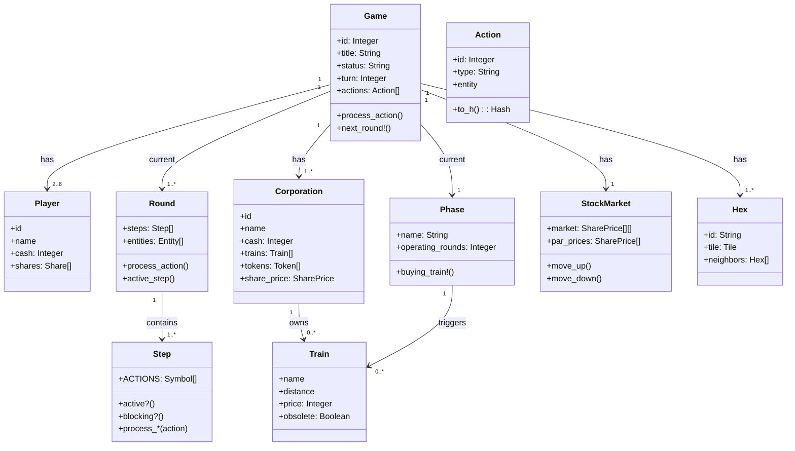
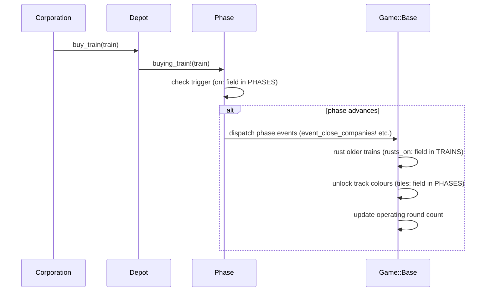

# Mental Model — 18xx.games

18xx.games models a game session as a sequence of Actions that a game engine processes deterministically. All game objects — stock market, map, trains, corporations — exist only in the engine's memory; only the Actions themselves are persisted.

## Game

A `Game` object is the engine's representation of a running session [`lib/engine/game/base.rb:91`]. It holds every game object (Corporations, Players, StockMarket, Hexes, Depot) and tracks the current Round. Each of the 100+ game titles is a subclass of `Game::Base` with its own constants (`TRAINS`, `CORPORATIONS`, `PHASES`, `HEXES`) [`lib/engine/game/base.rb:152-262`]. The database model `Game` (Sequel) stores metadata and references persisted moves via `has_many :actions` [`models/game.rb:1-10`].

## Player

A `Player` [`lib/engine/player.rb:1`] represents a human participant inside the engine. It holds cash, a certificate portfolio, and owns the Corporations for which it serves as president.

## Corporation

A `Corporation` [`lib/engine/corporation.rb:1`] is the investable railway company. It owns trains, has tokens on the map, and occupies a cell on the stock market. The share price determines its operating value and the dividend per share.

## Round

A `Round` [`lib/engine/round/base.rb:12`] is the container for all Steps in a turn segment. The four basic types are Stock Round (`SR`), Operating Round (`OR`), Auction Round, and Draft Round. Every Round holds an ordered list of `entities` (players or corporations) that act in sequence.

## Step

A `Step` [`lib/engine/step/base.rb:8`] models an atomic decision opportunity. It declares via `ACTIONS` which action types it can process, and signals whether it is *blocking* — meaning subsequent Steps only become active once this one is completed or passed [`lib/engine/round/base.rb:136-143`].

## Action

An `Action` [`lib/engine/action/base.rb:1`] is a persisted move. It carries the entity (who acts), the type (`buy_shares`, `lay_tile`, `run_routes`, etc.), and type-specific arguments. All Actions are stored as JSON in the database and replayed sequentially on load [`lib/engine/game/base.rb:819-837`].

## Phase

The `Phase` [`lib/engine/phase.rb:1`] manages game progression. Each train purchase can trigger a new phase (`buying_train!`) [`lib/engine/phase.rb:11-29`], which obsoletes older trains, unlocks new track categories, and changes the number of Operating Rounds per set.

## Train

A `Train` [`lib/engine/train.rb:1`] is the revenue engine of every Corporation. It has a reach (distance), a purchase price, and can become obsolete when a new phase begins. Without at least one train a Corporation earns no revenue.

## StockMarket

The `StockMarket` [`lib/engine/stock_market.rb:1`] is a two-dimensional grid of `SharePrice` objects. Buys and sells move a corporation's marker on this grid; special cells mark par, endgame triggers, or closure.

## Hex / Tile

A `Hex` [`lib/engine/hex.rb:1`] represents one hexagon on the game map. It contains a `Tile` with the current track layout and cities. `Tile` objects from the tile bank are placed onto Hexes during track-laying.

## Action Lifecycle

An Action begins as a user gesture in the browser and ends as a persisted record in the database. The same engine code runs on both sides; the client uses it for optimistic validation, the server for authoritative processing.

```mermaid
stateDiagram-v2
    [*] --> Created : User clicks a UI control
    Created --> LocalValidated : Client-side engine validates against local state
    LocalValidated --> Sent : HTTP POST to /api/game/:id/action
    Sent --> Replayed : Advisory Lock acquired; all prior Actions replayed
    Replayed --> ServerValidated : New Action applied to fresh engine state
    ServerValidated --> Persisted : Action inserted into actions table
    Persisted --> Broadcast : Published to Redis /game/:id channel
    Broadcast --> [*] : SSE delivers updated state to all connected clients
    ServerValidated --> Rejected : Validation error — 422 response
    Rejected --> [*] : Client shows error; no state change persisted
```

The key invariant: the database stores only the Action, never the derived state. Every load replays the full action list from scratch.

## Phase / Train Trigger

Buying the first copy of a train can advance the game phase. This is the primary mechanism for progressing through the game's development arc.

The `on:` field in each `PHASES` entry names the train whose first purchase triggers that phase. A single train purchase can both advance the phase and fire multiple events simultaneously.

## What was deliberately omitted

Graph (routing graph for revenue calculation), SharePool (bank pool for shares), Depot (train supply), Loan (player debt in some titles), and Minor (small subsidiary) are all present in the system but are not needed to understand the basic game flow.

## What's next

- How Actions are processed: [Core Flow](kernablauf.html)
- Technical internals of the engine: [Game Engine](game-engine.html)
- Round/Step in depth: [Round/Step System](round-step-system.html)
- Short definitions of all terms: [Glossary](glossary.html)

---
*Version: 2026-05-08 — derived from `lib/engine/game/base.rb`, `lib/engine/round/base.rb`, `lib/engine/step/base.rb`.*
