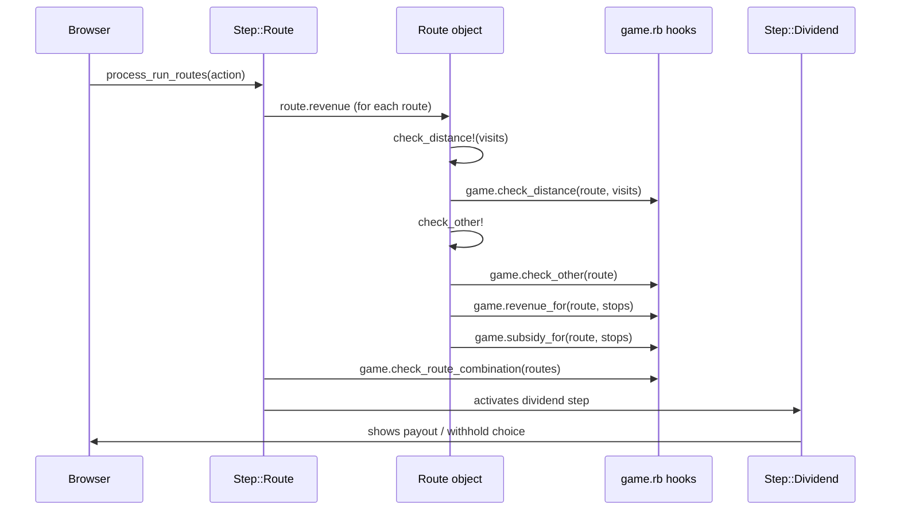

# Revenue & Routing

Running routes and paying dividends is the economic core of every 18xx Operating Round. This page explains how the engine computes revenue, which hooks `game.rb` can override for title-specific rules, and how the dividend step processes the payout.

---

## The Route Pipeline

When a player submits a route set, the engine runs this pipeline:



All revenue validation and calculation is delegated to game-level hooks. The `Route` object is the messenger; `game.rb` is the rule-book.

---

## The Graph

`Engine::Graph` [`lib/engine/graph.rb`] builds the connectivity map for a corporation from the current tile layout and token positions. It answers: "which hexes can this corporation reach, run through, and token?"

The engine creates a graph instance per corporation, caching it until the tile layout changes. You do not call `Graph` directly in most titles — the Step layer uses it automatically. But some overrides interact with it:

| Hook | When to use |
|------|-------------|
| `graph_skip_paths(corporation)` | Exclude certain paths from connectivity (e.g. narrow-gauge-only track when the corporation runs broad gauge) |
| `skip_token?(graph, corporation, city)` | Allow a corporation to use a city it has not tokened |
| `city_tokened_by?(city, entity)` | Custom token ownership logic (e.g., minors share a parent's tokens) |

---

## Revenue Calculation Hooks

### `revenue_for(route, stops)`

The primary revenue hook. Default implementation:

```ruby
def revenue_for(route, stops)
  stops.sum { |stop| stop.route_revenue(route.phase, route.train) }
end
```

Override this in `game.rb` to add bonuses, apply multipliers, or adjust stop values:

```ruby
# Add $20 bonus for every route that includes the port hex F8
def revenue_for(route, stops)
  base = super
  port_stop = stops.find { |s| s.hex.id == 'F8' }
  base + (port_stop ? 20 : 0)
end
```

### `routes_revenue(routes)`

Sums revenue across all routes run in one turn. Override only when routes interact — for example, an east-west bonus that applies only when the set of routes collectively spans the map:

```ruby
def routes_revenue(routes)
  base = routes.sum(&:revenue)
  base + east_west_bonus(routes)
end
```

### `extra_revenue(entity, routes)`

Additional revenue beyond train routes (default: 0). Useful for per-turn flat bonuses that don't belong to any individual route.

---

## Stop Values

Each stop on a route contributes its `route_revenue(phase, train)` to the total. The stop's revenue comes from the tile definition (`city=revenue:30` or phase-based `revenue:yellow_30|green_40|brown_50`).

You can override stop revenue at the game level without touching the tile definition:

```ruby
def revenue_for(route, stops)
  stops.sum do |stop|
    stop.route_revenue(route.phase, route.train) +
      hex_bonus(stop.hex, route.train)
  end
end

def hex_bonus(hex, train)
  # Reference: lib/engine/game/g_18co/game.rb
  BONUSES.fetch(hex.id, 0)
end
```

---

## Distance Validation

### `check_distance(route, visits, train = nil)`

Called automatically by `Route#check_distance!`. The base implementation handles both integer distance (a 4-train visits up to 4 cities/towns) and the complex array format (different limits per node type). You rarely need to override this unless your train type has custom counting rules.

### `route_distance(route)`

Returns the numeric distance consumed by a route. Override if some stops have a different visit cost — for example, towns that are free to pass through:

```ruby
def route_distance(route)
  route.visited_stops.sum do |stop|
    stop.tokened_by?(route.corporation) ? 1 : stop.visit_cost
  end
end
```

---

## Route Validation Hooks

### `check_other(route)`

Single-route validation hook (no-op by default). Raise a `GameError` to reject the route:

```ruby
def check_other(route)
  return if route.stops.any? { |s| home_hex?(s.hex, route.train.owner) }
  raise GameError, "#{route.train.owner.name} must include its home city on every route"
end
```

### `check_route_combination(routes)`

Multi-route validation hook — receives the complete set of routes a corporation is running. Raise a `GameError` to reject the combination:

```ruby
# Two routes may not share the same city stop
def check_route_combination(routes)
  cities = routes.flat_map { |r| r.stops.select(&:city?) }
  raise GameError, 'Routes may not share a city' if cities.uniq.length < cities.length
end
```

---

## Subsidies and Halts

### `subsidy_for(route, stops)`

Optional hook. Not defined in `Game::Base` — add it when your title has halts (unoccupied towns that pay a subsidy instead of normal revenue):

```ruby
def subsidy_for(route, stops)
  route.halts.size * halt_subsidy
end
```

### `routes_subsidy(routes)`

Sums subsidies across all routes (default: 0). Override only when subsidies interact across routes.

---

## Dividend Step

After routes are run, `Step::Dividend` presents the payout choice.

### `dividend_types`

Override in a custom Step to change which options the player sees:

```ruby
DIVIDEND_TYPES = %i[payout withhold half].freeze

def dividend_types
  DIVIDEND_TYPES
end
```

Each symbol must have a corresponding method that returns a hash describing the cash flow:

```ruby
def half(entity, revenue)
  amt = (revenue / 2 / entity.total_shares).floor * entity.total_shares
  { corporation: revenue - amt, per_share: amt / entity.total_shares }
end
```

### `share_price_change(entity, revenue)`

Controls stock market movement after dividend. The `revenue` argument is **the amount paid to shareholders** (total revenue minus the corporation's retained portion), computed in `dividend_options` as `revenue - payout[:corporation]`. The result hash is merged into the payout hash and executed by the step's `change_share_price`.

Default: RIGHT if payout > 0, LEFT if withhold:

```ruby
def share_price_change(entity, revenue)
  return { share_direction: :right, share_times: 1 } if revenue.positive?
  { share_direction: :left, share_times: 1 }
end
```

For games with a **three-way threshold rule** (RIGHT only when dividend ≥ share price, no movement in between, LEFT on withhold), override in `Step::Dividend`, not in `game.rb` — the game-level `change_share_price` is never called by the dividend path:

```ruby
# In G18OE::Step::Dividend (correct pattern, not yet implemented — BUG-013)
def share_price_change(entity, revenue)
  return {} if entity.type == :minor || entity.type == :regional
  return { share_direction: :left, share_times: 1 } if revenue.zero?
  return {} if revenue < entity.share_price.price
  { share_direction: :right, share_times: 1 }
end
```

> **Warning:** `game.rb#change_share_price` is a dead-end override for this purpose — it is never invoked by the dividend step. Place three-way logic in `Step::Dividend#share_price_change` only.

### Auto-processing

When a corporation type has no choice (e.g. minors always half-pay), suppress the UI entirely. See the [Rounds & Steps](round-step-system.html) page for the `actions` / `skip!` pattern.

---

## Operating Order

`operating_order()` in `game.rb` controls which corporations act and in what sequence. The default:

1. Floated minors, by share price descending (then by formation order)
2. Floated majors, by share price descending (then by formation order)

Override when your title has a different rule:

```ruby
# Corporations with a destination token operate last
def operating_order
  without_dest, with_dest = super.partition { |c| !c.destination_ran? }
  without_dest + with_dest
end
```

Reference: `lib/engine/game/base.rb` — search for `def operating_order`.

---

## National Revenue (virtual tokens)

Some titles give a national corporation virtual tokens in every city/town in its home zone, without placing physical tokens. The engine mechanism:

```ruby
# Create a national-aware graph — pass to Graph.new in game.rb
Engine::Graph.new(self, home_as_token: true, no_blocking: true)
```

`home_as_token: true` treats each home-zone hex as if the national has a token there. `no_blocking: true` means other corporations' tokens do not block the national's routing through those hexes.

Revenue calculation must then:
1. Identify all **linked** cities/towns in the zone via graph connectivity → count at face value (D trains double)
2. Fill remaining train capacity with **unlinked** stops → £60/city or £10/town (no linkage required)

Prerequisites: `NATIONAL_REGION_HEXES` must enumerate exactly which hexes belong to each zone, and cities must have non-zero revenues set.

Reference pattern: `lib/engine/game/g_1867/game.rb` — `national_revenue`.

---

## Common Revenue Patterns

| Pattern | Hook to override | Reference title |
|---------|-----------------|-----------------|
| Hex revenue bonus | `revenue_for` | 18CO |
| East-west route bonus | `routes_revenue` | 1830 |
| Halt subsidy | `subsidy_for` | 1860 |
| Revenue multiplier for special train | `revenue_for` + `extra_revenue` | 1817 |
| Mandatory home-city route | `check_other` | 18Chesapeake |
| No route overlap per segment | `check_route_combination` | base engine default |
| Half-pay dividend | custom Step::Dividend subclass | 1822, 1867 |
| Hold-price on withhold | `share_price_change` | many titles |

---

## Debugging Revenue

Load a fixture in IRB and inspect routes:

```ruby
require_relative 'lib/engine'
raw = JSON.parse(File.read('public/fixtures/1830/26855.json'))
g = Engine::Game::G1830::Game.new(
  raw['players'].map { |p| p['name'] },
  id: raw['id'],
  actions: raw['actions'].first(60)
)

# Inspect what routes are available for the current corporation
corp = g.current_entity
g.graph.reachable_hexes(corp).keys.map(&:id)

# Compute revenue for a hypothetical route
train = corp.trains.first
# routes are built by the UI; in IRB build one manually:
# Engine::Route.new(g, g.phase, train, routes: [], hexes: [hex_a, hex_b], ...)
```

---

## What's Next

- Writing a custom Step for dividend logic: [Rounds & Steps](round-step-system.html)
- Ability types that interact with routes: [Abilities](abilities.html)
- Testing revenue rules with fixtures: [Testing Your Game](testing.html)
- Reference game for complex routing: `lib/engine/game/g_1817/game.rb`

---
*Version: 2026-05-08 — derived from `lib/engine/route.rb`, `lib/engine/graph.rb`, `lib/engine/step/route.rb`, `lib/engine/step/dividend.rb`, `lib/engine/game/base.rb`.*
