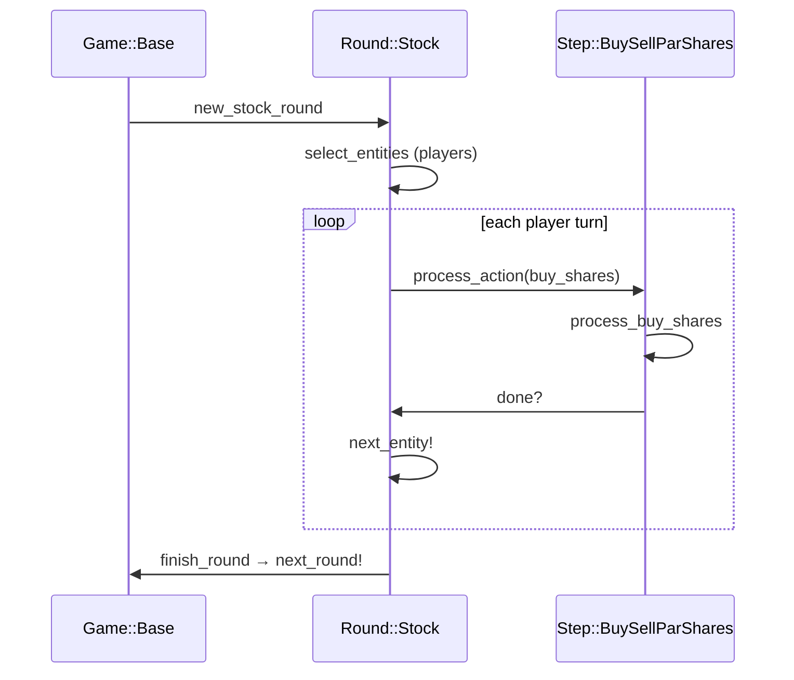
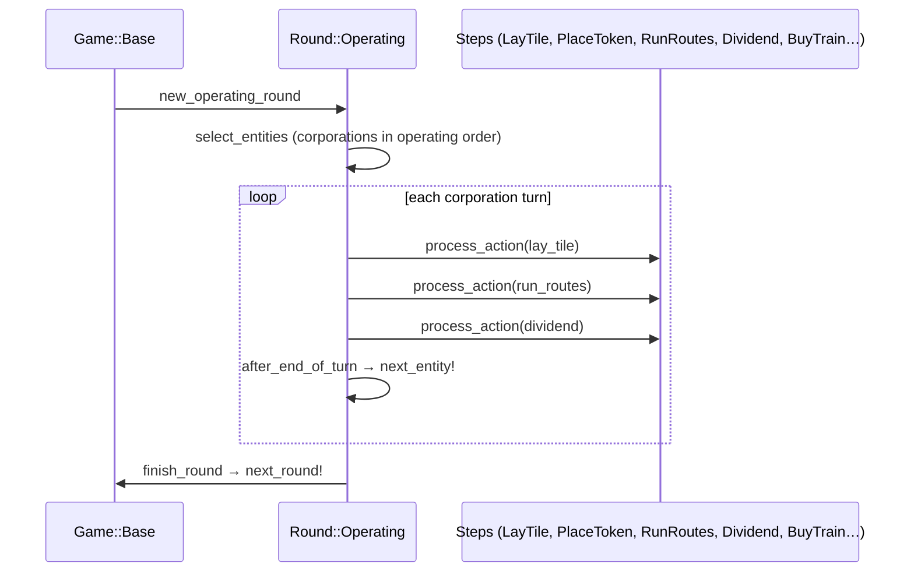

# Round/Step System

Every game action passes through a two-level dispatcher: a **Round** that holds an ordered list of **Steps**, and Steps that declare which action types they handle. Understanding this hierarchy is essential for adding new game mechanics or debugging an unexpected "greyed-out" button.

## Rounds

`Engine::Round::Base` [`lib/engine/round/base.rb:12`] is an abstract container for one turn segment. It holds:

- An ordered list of `Step` instances (`@steps`)
- An ordered queue of acting Entities (`@entities`)
- The index into that queue (`@entity_index`)

`Game::Base` instantiates concrete Round subclasses via factory methods:

| Round class | Short name | Factory method |
|-------------|------------|----------------|
| `Round::Stock` [`lib/engine/round/stock.rb:1`] | SR | `new_stock_round` (`:3177`) |
| `Round::Operating` [`lib/engine/round/operating.rb:7`] | OR | `new_operating_round` (`:3192`) |
| `Round::Auction` | — | title-specific |

After each action `Round::Base#after_process` decides whether the current Entity is done and calls `next_entity!` to advance the queue. When the queue is exhausted, `finish_round` is called, which triggers `Game::Base#next_round!` [`lib/engine/game/base.rb:2921`].

## Steps

`Engine::Step::Base` [`lib/engine/step/base.rb:8`] is the atomic decision unit.

### How a Step handles an action

When `Round::Base#process_action` receives an action [`lib/engine/round/base.rb:75`]:

1. It iterates the Step list in order.
2. For each Step it calls `blocking?` (`:84`) — if the Step is blocking and the action type is in the Step's `actions` list, the Step handles the action.
3. If no blocking Step claims the action, a `GameError` is raised.

### `blocking?` vs `blocks?`

- `blocking?` (`:84`) — returns true by default; the Step claims priority over lower-priority Steps.
- `blocks?` (`:88`) — can return false to let lower Steps act even when this Step is active.

This allows a Step to *monitor* an action type (e.g. log it) without preventing other Steps from handling it.

### `ACTIONS` constant

Each Step class defines `ACTIONS = [].freeze` (`:13`) and overrides it with the string action types it processes, e.g. `['buy_shares', 'sell_shares', 'par']`. The UI reads the union of all active Steps' `ACTIONS` to determine which buttons to enable.

### `round_state`

`round_state` (`:80`) returns a hash of variables the Step contributes to the Round's shared state (e.g. bought-this-round flags). This avoids coupling between Step classes.

## Sequence: Stock Round



## Sequence: Operating Round



## Standard OR Step Order

Each operating entity moves through these steps in order. The Round finds the first `blocking?` Step that handles each incoming action type.

| # | Step class | Action types | Notes |
|---|------------|-------------|-------|
| 1 | `Step::HomeToken` | — | Places home token if `HOME_TOKEN_TIMING` requires it |
| 2 | `Step::Track` | `lay_tile` | Yellow lays and upgrades |
| 3 | `Step::Token` | `place_token` | Station token placement |
| 4 | `Step::Route` | `run_routes` | Train routing and revenue calculation |
| 5 | `Step::Dividend` | `dividend` | Pay / withhold / split |
| 6 | `Step::BuyTrain` | `buy_train`, `sell_shares` | Train purchase; sell-shares sub-step for emergency buy |
| 7 | `Step::BuySellParShares` | `buy_shares`, `sell_shares`, `par` | Available to majors only in some titles |

Game titles add, remove, or replace steps by passing a custom step list to `new_operating_round`.

**18OE additions to the standard OR sequence:**
- After Step::Token: Transfer Tokens step (majors only — swap tokens between same-player majors)
- `Step::Consolidate` — active during the Consolidation round (Phase 5+)
- `Step::ConvertToNational` — fires when national formation is triggered at Phase 4/6/8

## Auto-Processing Single-Choice Steps

When an entity type has only one valid choice for a step (e.g. minors always half-pay), suppress the UI prompt entirely by returning `[]` from `actions` and handling the auto-action in `skip!`.

```ruby
def actions(entity)
  return [] if %i[minor national].include?(entity.type)
  super
end

def skip!
  case current_entity.type
  when :minor
    kind = total_revenue.zero? ? 'withhold' : 'half'
  when :national
    kind = total_revenue.zero? ? 'withhold' : 'payout'
  else
    return super
  end
  process_dividend(Action::Dividend.new(current_entity, kind: kind))
end
```

`dividend_types` must include every kind that `process_dividend` may be called with, including `:withhold` as a zero-revenue fallback — even for single-choice entity types. Reference: `g_1837/step/minor_half_pay.rb`.

## `select_entities` vs `blocks?`

`select_entities` determines who *participates* in the round — include all eligible entities broadly. `blocks?` determines whether a specific entity's turn is *active right now* — return `false` to auto-skip.

**Do not pre-filter in `select_entities`** based on state that can change mid-round (e.g. share ownership after a merge). The initial entity list is fixed; only `blocks?` is evaluated on every turn.

```ruby
# Broad selection — include all non-bankrupt players:
def select_entities
  @game.players
end

# Fine-grained gating — step auto-skips when nothing to do:
def blocks?(entity)
  entity.shares.any? { |s| %i[minor regional].include?(s.corporation.type) }
end
```

## Adding a New Step

1. Create `lib/engine/step/my_step.rb` inheriting from `Step::Base` (or the closest concrete subclass).
2. Override `actions(_entity)` to return the action type strings this step handles.
3. Implement `process_<type>(action)` for each action type.
4. Use `round_state` to declare step-level state variables shared with the Round.
5. Add the step to your title's `new_operating_round` or `new_stock_round` call.

## Writing Your First Custom Step

Before writing a new Step, confirm you cannot express the rule through a constant or a `game.rb` method override. A new Step is the right tool when:

- A new action type must be introduced that no existing Step handles.
- The decision sequence for a corporation type differs from the default order.
- An existing Step's logic cannot be expressed through `tile_lays`, abilities, or hook overrides alone.

### Worked Example: Mandatory Dividend for Minors

Goal: minor corporations in your game always pay out half their revenue — no player choice.

**Step 1 — Create the file**

```
lib/engine/game/g_8888/step/minor_half_pay.rb
```

**Step 2 — Inherit from the closest base**

```ruby
# frozen_string_literal: true

require_relative '../../../step/dividend'

module Engine
  module Game
    module G8888
      module Step
        class MinorHalfPay < Engine::Step::Dividend
          # Minors get no UI prompt — their dividend is auto-processed.
          def actions(entity)
            return [] if entity.type == :minor
            super
          end

          def skip!
            return super unless current_entity.type == :minor

            kind = total_revenue(@game.current_routes).zero? ? 'withhold' : 'half'
            process_dividend(Action::Dividend.new(current_entity, kind: kind))
          end

          # Every kind that process_dividend may be called with must appear here.
          def dividend_types
            %i[half withhold]
          end
        end
      end
    end
  end
end
```

**Step 3 — Register it in your operating round**

In `lib/engine/game/g_8888/game.rb`, replace the default `Engine::Step::Dividend` with your custom step:

```ruby
def operating_round(round_num)
  Round::Operating.new(self, [
    Engine::Step::Bankrupt,
    Engine::Step::Exchange,
    Engine::Step::SpecialTrack,
    Engine::Step::BuyCompany,
    Engine::Step::HomeToken,
    Engine::Step::Track,
    Engine::Step::Token,
    Engine::Step::Route,
    G8888::Step::MinorHalfPay,       # replaces Engine::Step::Dividend
    Engine::Step::DiscardTrain,
    Engine::Step::BuyTrain,
    [Engine::Step::BuyCompany, { blocks: true }],
  ], round_num: round_num)
end
```

**Step 4 — Test it**

Load a fixture or start a fresh game in IRB and replay up to the first minor OR:

```ruby
require_relative 'lib/engine'
g = Engine::Game::G8888::Game.new(%w[Alice Bob Charlie])

# Advance past auction into first OR
# (add actions as needed for your title)
g.current_entity.type   # => :minor
g.current_round.active_step.class  # => Engine::Game::G8888::Step::MinorHalfPay
```

### Anatomy of a Step

```
Engine::Step::Base
  ├── ACTIONS        — array of action type strings this step handles
  ├── actions(entity) — returns ACTIONS when active, [] to suppress UI for this entity
  ├── blocking?      — true by default; claims priority over lower steps
  ├── blocks?        — can return false to let lower steps through
  ├── process_*(action) — called by Round when this step claims the action
  ├── skip!          — auto-processes when no player choice is needed
  └── round_state    — hash of variables contributed to the Round's shared state
```

The `process_*` naming convention mirrors the action type: `process_lay_tile`, `process_buy_train`, `process_dividend`, etc. The Round dispatches by calling `public_send("process_#{action.type}", action)`.

### Where to look for existing Steps

| You need… | Look at |
|-----------|---------|
| Tile lay with extra free lays | `lib/engine/step/special_track.rb` |
| Token placement with teleport | `lib/engine/step/special_token.rb` |
| Buy company from bank or player | `lib/engine/step/buy_company.rb` |
| Emergency train purchase | `lib/engine/step/buy_train.rb` |
| Revenue calculation hook | `lib/engine/step/route.rb` |
| Waterfall / priority auction | `lib/engine/game/g_1822/step/` |
| Minor conversion | `lib/engine/game/g_1867/step/` |

Always inherit from the closest concrete Step rather than `Step::Base` directly — you get validation, error messages, and UI helpers for free.

---

## What's Next

- Engine class reference and layer taxonomy: [Game Engine](game-engine.html)
- Design decisions behind the replay model: [ADRs](adrs.html)
- Coding patterns for steps and rounds: [Coding Guidelines](coding-guidelines.html)
- Testing your Step with fixtures: [Testing Your Game](testing.html)

---
*Version: 2026-05-08 — derived from `lib/engine/round/base.rb`, `lib/engine/step/base.rb`, `lib/engine/round/operating.rb`, `lib/engine/round/stock.rb`, `lib/engine/game/base.rb`.*
