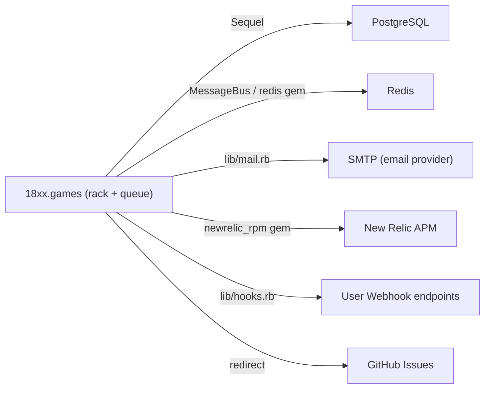

# System Boundaries and External Dependencies

18xx.games integrates with several external systems. This page maps each external dependency, its purpose, what happens when it is unavailable, and where the integration code lives.

## Dependency Map

## PostgreSQL

**Purpose:** Primary data store for users, games, sessions, and actions.

**Integration:** `Sequel` ORM via `sequel` and `sequel_pg` gems [`Gemfile:13-14`]. Connection string from `DATABASE_URL` or `APP_DATABASE_URL` environment variable [`db.rb:6`].

**Failure behaviour:** `db.rb` retries the connection up to 5 times with 5-second sleeps before raising. If the database is unavailable after startup, all API requests that require DB access will fail with 500.

**Advisory lock dependency:** `sequel-pg_advisory_lock` [`Gemfile:17`] is used to serialise concurrent action requests. This requires PostgreSQL; it cannot be swapped for another database.

## Redis

**Purpose:** MessageBus pub/sub for real-time game updates; user timestamp and stats cache.

**Integration:** `message_bus` gem with Redis backend [`Gemfile:4`]; `redis` gem for direct cache access [`Gemfile:12`]. URL hardcoded to `redis://redis:6379` in `lib/bus.rb:6`.

**Failure behaviour:** If Redis is unreachable, live-mode SSE updates will not be delivered to browsers, but game actions will still be processed and persisted. The API will log errors from MessageBus publish calls.

## Email (SMTP)

**Purpose:** Turn-notification emails to players in async games.

**Integration:** `lib/mail.rb`; called from `queue.rb` in the `/turn` MessageBus subscriber. The subject includes the game title, ID, and type (e.g. "Your turn").

**Failure behaviour:** Email delivery failure is caught and logged; the action is still accepted. Addresses from `@msn`, `@hotmail`, `@outlook`, `@live`, `@icloud`, or `@yahoo` domains are suppressed to reduce bounce rates [`queue.rb:88`].

## New Relic APM

**Purpose:** Production application performance monitoring.

**Integration:** `newrelic_rpm` gem [`Gemfile:5`]; loaded as a Roda plugin in production only [`api.rb:61`].

**Failure behaviour:** If the licence key is absent or New Relic is unreachable, the plugin is simply not loaded (development) or silently degraded (production).

## User Webhook Endpoints

**Purpose:** Real-time game-event notifications for users who prefer webhooks over email.

**Integration:** `lib/hooks.rb`; called from `queue.rb`. Users configure a webhook URL and optional user ID in their profile settings.

**Failure behaviour:** Errors from webhook delivery are caught and printed; the action processing is not affected [`queue.rb:75`].

## GitHub Issues

**Purpose:** Bug reports and feature requests.

**Integration:** The API redirects `/issues/<label>` to `https://github.com/tobymao/18xx/issues?q=...` with the matching label filter [`api.rb:179-190`]. No GitHub API token is required; it is a plain redirect.

**Failure behaviour:** If GitHub is unreachable, the redirect target will simply not load in the user's browser.

## What Is Internal

The following components are **not** external dependencies — they run inside the Docker stack:

- PostgreSQL (container `db`)
- Redis (container `redis`)
- Nginx reverse proxy (container `nginx`, production only)

## What's next

- Container layout and environment variables: [Configuration and Operations](konfiguration-betrieb.html)
- Full system topology: [Architecture Overview](architecture.html)

---
*Version: 2026-05-08 — derived from `lib/bus.rb`, `db.rb`, `queue.rb`, `api.rb`, `Gemfile`, `docker-compose.prod.yml`.*
