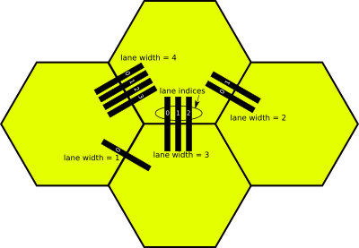
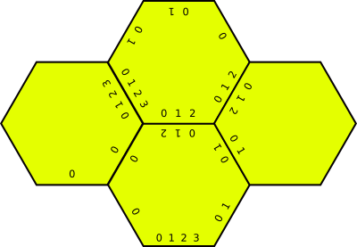
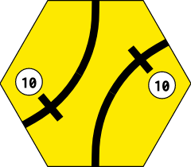
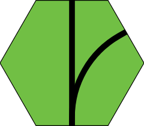
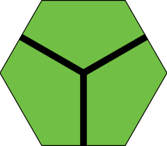
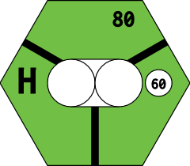
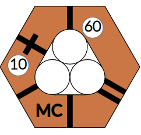
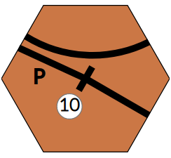
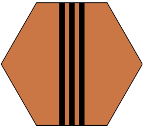

# Tile Reference

Tiles are defined as string expressions in `lib/engine/tile.rb`. This page covers the tile language, the anatomy of a tile, and the development routes available for inspecting tiles in a running local instance.

---

## Development Routes

A running local instance (see [Getting Started](getting-started.html)) exposes these routes for tile development:

| Route | Purpose |
|-------|---------|
| `/tiles/all` | Renders all tiles defined in `lib/engine/tile.rb` |
| `/tiles/<tile_name>` | Renders a single tile at large scale |
| `/tiles/<game_title>/<hex_or_tile>` | Renders a hex or tile from a specific game at large scale. Multiple hex/tile names separated by `+`. |
| `/tiles/<game_titles>/all` | Renders all tiles for one or more game titles (fuzzy matched, `+`-separated) |
| `/map/<game_title>` | Renders the full map for the given game title |

**Optional URL parameters:**

| Param | Meaning |
|-------|---------|
| `r=<rotation>` | Integer rotation, multiple rotations as `+`-separated integers, or `all` for all 6. Ignored at `/tiles/all`. |
| `n=<location_name>` | Location name rendered on tiles that have at least one stop. Pre-printed names are not overridden. Ignored at `/tiles/all`. |
| `grid` | Overlays the triangular grid to identify regions on a tile. |

Rotation can also be embedded in the tile name: `/tiles/9-1` renders tile `9` with rotation 1; `/tiles/7-2+8-2` renders tiles 7 and 8 both with rotation 2. In-name rotation ignores the `r=` param.

---

## Anatomy of a Tile

A flat-top hex and a pointy-top hex label their edges and regions differently. Both diagrams below show the edge numbering used by `path=a:N,b:N` in the tile language.


---

## Tile Language

A tile string consists of **main parts** separated by `;`. Each main part has **sub parts** separated by `,`. Properties within sub parts are separated by `|`.

Some tile properties are *not* part of the tile string and are defined elsewhere in the game configuration:

- **Color** — set on the `Hex` or upgraded from the game map
- **Location names** — set in `LOCATION_NAMES` constant
- **Reserved city slots** — set in `CORPORATIONS` / `COMPANIES` home coordinates
- **Blockers** — set via `blocks_hexes` abilities

---

### Main Parts

#### `city`

A revenue-generating city node that can hold station tokens.

| Sub part | Type | Default | Meaning |
|----------|------|---------|---------|
| `slots` | integer | `1` | How many tokens this city can hold |
| `revenue` | integer or phase spec | required | Revenue value; see phase-based revenue below |
| `groups` | `\|`-separated strings | — | Routes cannot contain more than one stop from the same group |
| `hide` | `1` | — | Do not render the revenue value |
| `loc` | e.g. `center`, `2` | — | Position on the hex (pointy layout) |

#### `town`

A smaller revenue center that cannot hold station tokens.

| Sub part | Type | Default | Meaning |
|----------|------|---------|---------|
| `revenue` | integer or phase spec | required | Revenue value |
| `style` | `rect` / `dot` / `hidden` | auto | `rect` when 1–2 paths connect; `dot` when 0 or 3+; `hidden` for special offboards |
| `groups` | `\|`-separated strings | — | Same-group route restriction |
| `hide` | `1` | — | Do not render the revenue value |

#### `offboard`

An off-map revenue terminus. Not rendered as a node itself, but changes how connecting track is drawn — track to offboards is tapered and pointed.

Same sub parts as `city` (`revenue`, `groups`, `hide`).

#### `path`

A track segment connecting two points.

| Sub part | Type | Meaning |
|----------|------|---------|
| `a` | edge int or `_N` node ref | required — first endpoint |
| `b` | edge int or `_N` node ref | required — second endpoint |
| `terminal` | `1` or `2` | Non-passthrough path (offboard track). `2` draws a shorter taper. |
| `ignore` | `1` | Skip this path during node-walk (used for special offboards) |
| `a_lane` | `width.index` | Lane width and index for the `a` endpoint |
| `b_lane` | `width.index` | Lane width and index for the `b` endpoint |
| `lanes` | integer | Number of parallel tracks. Auto-assigns `a_lane` / `b_lane` for each copy. |
| `track` | `broad` / `narrow` / `dual` | Track gauge type, used for display and connectivity. Default: `broad` |

Node references use an underscore followed by the zero-based index of the previously defined part: `_0` is the first city/town/offboard/junction, `_1` is the second, etc.

#### `label`

A large letter or short text rendered on the tile (e.g. `H`, `OO`, `Chi`, `Z`).

`label=H`

#### `upgrade`

Terrain cost marker.

| Sub part | Type | Meaning |
|----------|------|---------|
| `cost` | integer | required — cost to lay a tile on this hex |
| `terrain` | `mountain` / `water` (or `mountain\|water`) | Terrain type(s) |
| `loc` | corner spec | Render position (pointy layout only) — `5.5` = between edges 5 and 0 |

#### `border`

Modifies the rendering of one hex edge.

| Sub part | Type | Meaning |
|----------|------|---------|
| `edge` | integer | required — which edge (0–5) |
| `type` | `mountain` / `water` / `impassable` | Border type. Without type, draws a color-matched line to join adjacent tiles. |
| `cost` | integer | Cost to cross (mountain/water borders) |

#### `junction`

The center point of a Lawson-style tile. Referenced as a node by `path` using `_N`.

`junction;path=a:0,b:_0;path=a:2,b:_0;path=a:4,b:_0`

#### `icon`

An SVG icon on the tile.

| Sub part | Type | Meaning |
|----------|------|---------|
| `image` | string | required — name; rendered from `public/icons/<image>.svg` |
| `name` | string | Name for this icon instance; defaults to `image` |
| `sticky` | `1` | Icon remains visible after a tile upgrade |
| `blocks_lay` | (flag) | Tile cannot be placed normally; only via special ability |
| `loc` | corner spec | Render position (pointy layout only) |

#### `frame`

Colored border frame around the tile.

| Sub part | Meaning |
|----------|---------|
| `color` | required — primary frame color |
| `color2` | Optional second frame color |

---

### Phase-Based Revenue

Revenue that changes by phase uses an underscore-separated `phase_value` format, with multiple phases separated by `|`:

```
revenue:yellow_40|green_50|brown_60|gray_80
```

---

### Lanes

Lanes specify paths for double-track, treble-track, and quad-track tiles. Each path endpoint has two attributes:

- **width** — number of tracks connecting to that edge
- **index** — position within those tracks (0 = most clockwise)

The `lanes` sub part on a `path` automatically creates `N` parallel paths between the two endpoints with correctly assigned `a_lane` / `b_lane` values. Use `a_lane` / `b_lane` explicitly only when endpoints connect in an unusual way (e.g. a double-track edge to a single-track edge).





---

## Tile String Examples

**Tile #1 — two towns connected by through track:**

```
town=revenue:10;town=revenue:10;path=a:1,b:_0;path=a:_0,b:3;path=a:0,b:_1;path=a:_1,b:4
```



---

**Tile #23 — plain track, no revenue center:**

```
path=a:0,b:3;path=a:0,b:4
```



---

**Lawson tile #81 — junction with three arms:**

```
junction;path=a:0,b:_0;path=a:2,b:_0;path=a:4,b:_0
```



---

**1889 — tile 439 (city with label and upgrade cost):**

```
city=revenue:60,slots:2;path=a:0,b:_0;path=a:2,b:_0;path=a:4,b:_0;label=H;upgrade=cost:80
```



---

**1889 — preprinted tile for H5 (terrain only, no track):**

```
upgrade=cost:80,terrain:water|mountain
```


---

**18Chesapeake — preprinted tiles for A3 and B2 (split offboard with border and phase revenue):**

- A3: `city=revenue:yellow_40|green_50|brown_60|gray_80,hide:1,groups:Pittsburgh;path=a:5,b:_0;border=edge:4`
- B2: `offboard=revenue:yellow_40|green_50|brown_60|gray_80,groups:Pittsburgh;path=a:0,b:_0;border=edge:1`


---

**18Chesapeake — preprinted tile for H6 (two-city OO hex with water upgrade cost):**

```
city=revenue:30;city=revenue:30;path=a:1,b:_0;path=a:4,b:_1;label=OO;upgrade=cost:40,terrain:water
```


---

**18Chesapeake — preprinted tile for K3 (two unconnected towns):**

```
town=revenue:0;town=revenue:0
```


---

**18MEX — upgrade for Mexico City (multi-slot city with town, lanes, and label):**

```
city=revenue:60,slots:3,loc:center;town=revenue:10,loc:2;path=a:0,b:_0;path=a:1,b:_0;path=a:3,b:_0;path=a:2,b:_1;path=a:5,b:_0,lanes:2;path=a:_1,b:_0;label=MC
```



---

**18MEX — upgrade for Puebla (town with mixed-lane paths and label):**

```
town=revenue:10;path=a:2,b:_0,a_lane:2.1;path=a:5,b:_0;path=a:2,b:4,a_lane:2.0;label=P
```



---

**1831 — tile 301c (triple-track path using `lanes:3`):**

```
path=a:0,b:3,lanes:3
```



---

## What's next

- Ability types that interact with tile laying: [Ability Types Reference](abilities.html)
- `tile_lays` slot mechanics in the engine: [Game Engine](game-engine.html)
- Developer routes for testing other game features: [Getting Started](getting-started.html)

---
*Version: 2026-05-08 — derived from `TILES.md`, `lib/engine/tile.rb`.*
